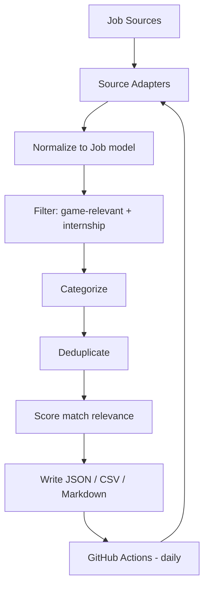

# 🎮 Game Internships Aggregator

An open-source, automatically-updating aggregator of **game development internship and co-op listings**, built entirely on free GitHub infrastructure (no paid server required).

> **Status:** Phase 1 — repository foundation. Source adapters, filtering, and automation are being built incrementally. See [Roadmap](#roadmap).

## What this is

Sites like Simplify aggregate internships across *all* industries. This project does the same thing, but specifically for game development: gameplay programming, engine programming, graphics, game design, technical art, QA, and production internships/co-ops.

## Why it exists

Game industry internships are scattered across dozens of individual company career pages, several different job-board platforms (Greenhouse, Lever, Ashby), and generic aggregators that bury them under thousands of unrelated software roles. This project pulls only the game-relevant postings into one place, updated daily, for free.

## How it works

```
Job Sources (Greenhouse / Lever / Ashby public job boards)
     ↓
Source Adapters — normalize each API's format into one Job model
     ↓
Filter — is this actually game development? is it an internship/co-op?
     ↓
Categorize — Programming / Design / Art / Production / QA / Other
     ↓
Deduplicate — same job posted more than once?
     ↓
Score — how relevant is this to gameplay/engine programming specifically?
     ↓
Write outputs — internships.json / internships.csv / jobs.md
     ↓
GitHub Actions — runs the whole pipeline once a day, commits changes
```



## Supported sources

| Source | Status |
|---|---|
| Greenhouse job boards | Planned — Phase 2 |
| Lever job boards | Planned — Phase 2 |
| Ashby job boards | Planned — Phase 2 |
| Direct company APIs | Case-by-case, only where a public endpoint is verified |

This project **never scrapes past authentication, CAPTCHAs, or robots.txt restrictions**, and never fabricates a company's API endpoint. If a company doesn't expose a usable public job feed, it is documented as unsupported rather than scraped unreliably.

## Categories

Programming (Gameplay / Engine / Graphics / Tools / AI / Network / Technical), Game Design (Level / Systems / Technical Designer), Art (Technical / 3D / Character / Environment / VFX / UI Artist), Production, QA, and Other (Audio, Narrative, Research, Community).

## How jobs are filtered

Every listing is scored against weighted keyword groups (game-related terms, programming-language/engine terms, internship/student terms) rather than a single keyword match — see `src/processing/filters.py` (Phase 3).

## How matching works

Each job gets a `match_score` based on a configurable weight table (e.g. "Unreal Engine" +5, "C++" +4, "Software Engineer" +2) tuned for someone interested in gameplay/engine programming and full-stack development. See `src/processing/filters.py` (Phase 3).

## How often it updates

Once daily via GitHub Actions (`.github/workflows/update.yml`, added in Phase 6), plus on-demand via manual trigger.

## Running locally

```bash
git clone https://github.com/<your-username>/game-internships.git
cd game-internships
python3 -m venv venv
source venv/bin/activate      # Windows: venv\Scripts\activate
pip install -r requirements.txt
python -m src.main
```

## Contributing

See [CONTRIBUTING.md](CONTRIBUTING.md).

## Data source limitations

* Only sources with a legitimate, public, unauthenticated API are supported.
* Some studios (particularly ones using custom-built career portals) may not be supported until a suitable public endpoint is verified.
* Expiration detection is conservative: a job is only marked `expired` when a source explicitly says so, otherwise it is marked `unknown` rather than guessed.

## Roadmap

- **v1** — Python pipeline → JSON/CSV/Markdown → GitHub Actions *(in progress)*
- **v2** — More sources, better filtering/deduplication, more companies
- **v3** — React frontend with search, filters, sorting, saved jobs
- **v4** — Backend API + PostgreSQL + accounts + bookmarks + notifications
- **v5** — AI features (resume-to-job matching, description summarization, "why am I a good fit")

## License

MIT — see [LICENSE](LICENSE).
